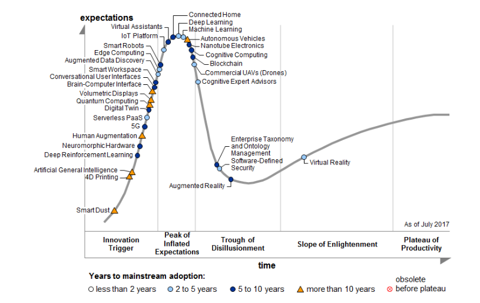
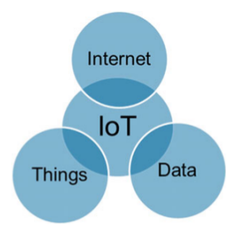
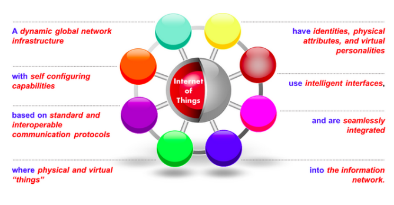
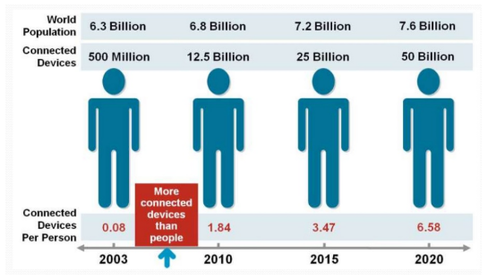

# Situazione

## Definizioni di IoT

Ci sono più iperboli che buon senso nel mondo di Internet of Things. Capire cos'è IoT non è facile. Prima acquisiremo esperienza e prima comprenderemo il suo campo applicativo, che sarà probabilmente diverso dalle idee originali.

Lo _Hype_ è grande. Il **Gartner Group**, che ha molto entusiasmo per IoT, lo pone vicino al picco delle aspettative inflazionate.

## Definizione Sempliciatica

Interattività intelligente tra umani e cose per lo scambio di informazioni e conoscenza nella creazione di nuovo valore.

Sono tutte parole generiche e imprecise.

Altri vanno ancora più avanti:

* IBM : _Smarter Planet_
* Cisco : _Internet of Everything_ = Digitizzazione
  * Conversione di tutte le informazioni a formato digitale
  * Integrazione di dati, esseri umani e processi business
  * Interconnessione e interscambio informazioni

E cos'è un -Thing_:

* **Thing = Not a computer**
  * Anything, Anywhere, Anytime, Anyway, Anyhow

E si, anche gli animali e gli esseri umani in alcune visioni sono interconnessi e parte di IoT.

### Definizione CERP-IOT

Infrastruttura dinamica di rete globale con capacità di autoconfigurazione basata su protocolli di comunicazione standard ed interoperabili ove le “cose” fisiche e virtuali hanno identità, attributi fisici e personalità virtuali, usano interfacce intelligenti e sono integrate nella rete informativa.

Aspetti:

* **IoT** - Internet of Things
* **IoM** - Internet of Media
* **IoS** - Internet of Services
* **IoE** - Internet of Enterprises

Ogni elemento della frase di definizione ha un suo significato specifico.

## Dispositivi Connessi

* 2020: 26 dispositivi per persona (mondo sviluppato)
* Impatto economico 2020: $5 trilioni

## Vincoli alle Reti IoT

* **Scalabilità**
  * Il numero di componenti è molti ordini di grandezza maggiore che reti IT
  * L’indirizzamento IPv4 non basta
  * Il passaggio a IPv6 è prima o poi indispensabile
* **Sicurezza**
  * I dispositivi sono nel mondo fisico, non virtuale
  * E' necessaria la difesa dei dispositivi e delle reti
  * Le Cose non devono arrecare danni agli umani
    * Tre Leggi della Robotica (?) - Asimov
* **Risorse Limitate**
  * CPU, memoria, banda trasmissiva
    * Occorrono protocolli che minimizzino lo spreco di risorse
* **Volume di Dati**
  * I sensori generano volumi enormi e continui di dati
    * Necessità di filtraggio
    * Necessità di analisi e controllo vicino alla sorgente e di tipo distribuito
* **Supporto Legacy**
  * Non è pensabile un’implementazione ex novo, tranne che in alcuni settori definiti
  * La rete con protocolli IP è quella che abbiamo
* **Real Time**
  * L’acquisizione dei dati deve essere rapida
  * Il controllo dei dispositivi deve essere quasi immediato
    * Spesso vi sono conseguenze sui sistemi operativi usati
    * Necessario il Real Time: tempi di risposta prevedibili
    * Non va bene il Time Sharing
  * Conseguenze sui linguaggi di programmazione
    * Non possono avere tempi morti imprevisti
    * Non possono essere basati su Garbage Collection automatico
    * Si devono sfruttare più CPU e Core computazionali

