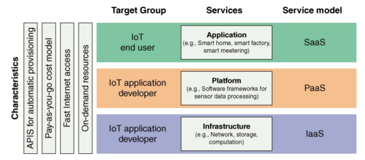
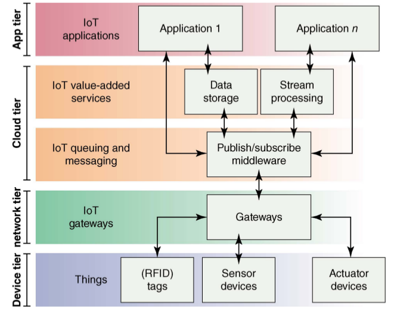

# Modelli per IoT

## Necessità di un Modello

Vi sono molte ragioni per cui è necessario un modello a strati dell'ambiente di Internet of Things:

* Decomporre il problema in parti costitutive
* Identificare le tecnologie ad ogni livello e le loro relazioni
* Vendor diversi ad ogni livello
* Interfacce per definire l’interoperabilità
* Definire un corrispondente modello di sicurezza

Esempi di modelli esistenti:

* Modello ISO/OSI di connettività di rete
* Modello DoD dei protocolli Internet

## Modello IoT World Forum

E' un modello completo e complesso, in particolare adottato dalla versione _Cisco_ di IoT.

I livelli sono i seguenti:

* Liv 1: **Dispositivi Fisici e di Controllo**
  * Le “cose” con i loro sensori ed attuatori
  * Possono avere qualsiasi dimensione fisica
* Liv 2: **Connettività**
  * Trasmissione efficiente ed efficace dei dati
  * Copre tutti gli elementi contribuenti alla connettività, a varie scale
  * Funzioni:
    * Comunicazione tra i dispositivi a Livello 1
    * Recapito affidabile delle informazioni in tutta la rete
    * Routing e Switching
    * Traduzioni tra protocolli
    * Sicurezza a livello di rete
* Liv 3: **Edge Computing**
  * Converte i dati in informazioni
  * Principio: massima località di processamento dati
  * Anche detto **Fog Layer**
  * Funzioni:
    * Valutare la validità dei dati
    * Riformattare e normalizzare i dati
    * Filtrare e aggregare i dati per ridurne la quantità
    * Allertare su condizioni anomale o superamento di soglie
    * Rendere i dati pronti per il processamento a livelli superiori
* Liv 4: **Accumulazione**
  * Cattura e storaggio dei dati
  * Conversione a formato adatto alle Query
* Liv 5: **Astrazione**
  * Si assicura della consistenza da più sorgenti dati
  * Verifica la completezza dei dati
  * Fornisce Viste ed eventuali Virtualizzazioni
* Liv 6: **Applicativo**
  * Applicazioni che usano i dati
  * Generano rapporti basati sull’analisi dei dati
  * Controllano l’ambiente avendo compreso i dati
* Liv 7: **Collaborazione**
  * Produce e consuma i dati con altri applicativi
  * Contribuisce ai Processi Business
  * Produce il vero Valore di IoT

### Modello DIKUW dei Dati

Considerando che un grosso compito di IoT è l'acquisizione, quindi trasmissione e processamento di _dati_, il modello IoT World Forum_ ha un parallelo notevole col _Modello DIKUW_ di trattamento dati in ambito di **Knowledge Engineering**.

### Separazione di Livelli

I 3 livelli inferiori sono attinenti al mondo di Internet of Things, e vengono detti Livelli **OT** (_Object Technologies_). I 4 livelli superiori sono derivati più direttamente dal mondo informatico e vengono detti Livelli **IT** (_Information Technologies_).

Il, o i due livelli più bassi vengono spesso riferiti anche come **Edge Computing** (_al limite_). Di conseguenza i livelli più alti sono detti **Centre**.

## Modelli Alternativi

* **Purdue Model for Control Hierarchy** (_PMCH_)
  * Base per lo _IEC 62443 Cyber Security Standard_
* **Industrial Internet Reference Architecture** (_IIRA_)
  * Industrial Internet Consortium (_IIC_)
  * Livello di astrazione più alto ed orientato a processi industriali
* **Internet-of-Things Architecture** (_IoT-A_)
  * Paradigma sperimentale e in evoluzione
  * Identifica blocchi di base usati da IoT
  * Combinazione di approcci Top-Down e Sperimentale

E' da notare che manca una adozione globale di un singolo modello, vista la limitata esperienza mondiale con Internet of Things.

Vi sono svariati alri modelli, a tre o cinque livelli.

## Modello Semplificato

Il modello informale più usato è a tre livelli.

Viene separato il profilo **funzionale** dal profilo **gestionale**.

In quest'ultimo vige l'analogia meteorologica:

* **cloud** - ambienti computazionali e di processamento in un luogo remoto, il centro per IoT
* **fog** - il luogo di calcolo intermediario, più vicino alle _cose_
* **mist** - (_foschia_) le capacità di calcolo, molto limitate, delle _cose_ stesse; corrisponde allo **Edge Computing**.

Lo stack funzionale è anche detto **core** e a sua volta viene espanso in più livelli. Non tutti questi livelli espansi devono necessariamente esistere, dipende dall'applicazione.

## Requisiti di Sistema per IoT

Ci si riferisce ai servizi che i livelli computazionali devono offrire ai livelli fisici.

Requisiti di base:

* distribuzione dati - OT sono sorgenti dati molto grosse
  * middleware unificato indipendente dal _vendor_
  * _near real time_
  * API standardizzate
* storaggio scalabile - variabilità e picchi imprevedibili di generazione dati
  * raccolta storica di dati
* servizi di processa mento - _big data_ e _analytics_
  * correlazioni

Requisiti aggiuntivi di elevata qualità:

* organizzazione flessibile
* affidabilità
* scalabilità
* confidenzialità e sicurezza

Due paradigmi principali:

* cloud computing
* fog computing

### Cloud Computing

Applicativi forniti come servizi da datacenters _da qualche parte_ nell'Internet. Tre tipologie di servizi:

* **SaaS** - _Software as a Service_
* **PaaS** - _Platform as a Service_
* **IaaS** - _Infrastructure as a Service_

Servizi diversi hanno per target gruppi diversi.

L'architettura _Cloud Based_ è come segue:

Di solito i _devices_ non accedono direttamente all'Internet, sia per motivi di sicurezza, sia perchè non anno a bordo una catasta sufficiente mente sofisticata di protocolli di comunicazione.

Qualora ce l'avessero, userebbero probabilmente tecnologie _Last Mile_, p.es. DSL o 3G/4G, che possono causare un collo di bottiglia.

I device accedono ad un **Gateway**, che fornisce un _disaccoppiamento_ comunicativo tra il mondo OT ed IT, e si occupa dell'aggregazione ed eventuale ritrasmissione dei dati.

La scala e latenza dell'approccio _Cloud_ sono illustrate dal diagramma seguente.

Vantaggi di questo approccio:

* flessibilità
* affidabilità
* ubiquità - diffusione capillare degli accessi a Internet
* velocità di sviluppo degli applicativi (_Time To Market_).

Adatto a grandi situazioni:

* applicativi industriali
* smart cities (traffico, trasporto, edifici, ...)
* e-Health
* finanziario

Svantaggi:

* alta banda di trasmissione dati
* mancanza di filtraggio vicino al _data source_
* latenza non prevedibile - tra i dati dei sensori e gli ordini agli attuatori
* necessità di connessione costante ad Internet
* preoccupazioni di privacy e sicurezza - i dati viaggiano direttamente in Internet

### Fog Computing

Termine coniato da _Cisco_: portare parte dell'intelligenza, servizi e capacità di processamento vicino ai device.

Il livello fisico e il livello _fog_ insieme sono anche detti **Edge** (_Edge Computing_, _Intelligent Edge_, ...)

La scala e la latenza del modello _Fog_ sono illustrate dal diagramma seguente.

Il modello prevede una serie di _gateways_, di bassa intelligenza, direttamente connessi a servizi IT locali.

I gateways possono essere, p.es. _Raspberry Pi_, _Beaglebone Black_, o simili.

La connessione al _Cloud_ rimane, ma per servizi di storaggio e analisi dei dati, _big data_ e _analytics_, non per il controllo dei devices.

Vantaggi:

* bassa latenza - nella comunicazione coi devices
* continuità - in caso di irraggiungibilità temporanea dell'Internet
* minor requisiti di banda comunicativa
* maggior confidenzialità e sicurezza dei dati - che sono 'scopribili' solo in un ambito più limitato
* filtraggio dei dati ridondanti o inutili prima della loro comunicazione al _Cloud_

Adatto a certi tipi di situazioni, con maggiore _località_ di interazione, e dove non siano necessarie _correlazioni_ per prendere una decisione:

* smart grid
* veicoli intelligenti
* smart home
* indossabili
* _swarms_ di sensori
* sorveglianza e sicurezza

Infatti il modello è applicabile anche ad alcuni casi di dominio industriale, smart cities ed _e-Health_.

Problemi del modello _Fog_:

* interoperabilità tecnologica - dei protocolli di comunicazione tra _devices_ e _fog_. Spesso il gateway si trova a dover essere un traduttore di protocollo.
* interoperabilità semantica - sensori diversi sono stati pensati con visioni _ontologiche_ diverse della realtà
* programmabilità - del livello _fog_, decisioni su linguaggi, interfacce, container o macchine virtuali, schemi crittografici, ecc.
* configurazione - ogni device dev'essere configurato per comunicare con un gateway in modo sicuro. Può essere un problema eccessivo per i non tecnici.

