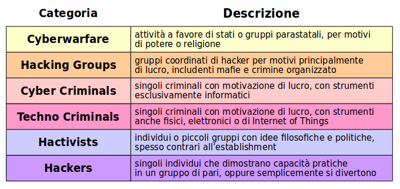

# Cybersecurity

## Panorama

### Situazione

Negli ultimi anni il panorama della Cybersecurity è cambiato drasticamente. Non si tratta più solo di virus, spam, diniego di servizio; ora si parla di frode, furto d’identità, dossieraggio, spionaggio.

### Motivi

* La società è altamente dipendente da procedure ed operazioni on line
  * Non è possibile un ritorno al passato
  * La consapevolezza della sicurezza informatica è scarsa
* E' come condurre guerre di difesa nuove con armi e mentalità vecchie
  * I protocolli di rete e gli applicativi sono deboli
  * Il design di sicurezza è un costo aggiuntivo

* La difendibilità totale è impossibile
  * Tutti i sistemi informativi sono vulnerabili per loro proprietà intrinseche
  * Il crimine informatico è estensione del crimine fisico

Si può compiere un'analogia con le malattie reali:

* L’organismo umano ha molti nemici naturali alla salute
* Si verificano epidemie e vaste perdite di vite umane

Le contromisure da adottare sono dello stesso tipo di quelle della Medicina:

* Pratiche pervasive di salute informatica
  * Igiene fisico e comportamentale → Igiene informatico
* Studio continuato degli attacchi e delle difese
  * Ricerca epidemiologica → Ricerca sulla sicurezza IT
* Enti ufficiali di rapido intervento
  * Organismi sanitari → Organismi di difesa cibernetica

## Percezione della Sicurezza

La sicurezza significa cose diverse per persone diverse.

* Ufficiale addetto alla sicurezza
  * Protezione
  * Confidenzialità, Integrità, Disponibilità
  * Fiducia
* Manager
  * Costo e lavoro aggiuntivo
  * Richieste indesiderate
  * Impossibile
* Utente
  * Regole irragionevoli
  * Ostacolo al lavoro produttivo
  * Necessità di corsi di aggiornamento
  * Preoccupazione non veramente percepita

In realtà la sicurezza deve essere una preoccupazione di tutti:

* E’ basata sulla cultura dell’organizzazione
* Protegge gli asset e gli interessi organizzativi
* E’ insita in ogni processo aziendale

Necessità:

* Renderla possibile
* Renderla semplice
* Evidenziare il progresso e i risultati

### Trends della Sicurezza Informatica

## Modello CIA di Sicurezza dei Dati

Si sono evoluti una serie di modelli per rappresentare le situazioni di cybersecurity, gli attori (attaccanti) coinvolti, la tipologia di operazioni, i danni causati.

Il più noto è il **Modello CIA**.

E' una abbreviazione di Confidentiality, Integrity, Availability. Non ha nulla direttamente a che fare con l’omonima agenzia di intelligence.

Questo modello si concentra sui tipi di attacchi ai dati e alla loro compromissione:

* Definisce tre tipologie di motivazione per gli attacchi
* Separa attacchi compiuti da gruppi e da individui

Il Modello CIA distingue sei tipi di **Figure Attive** - un eufemismo per dire _attaccanti_.

Queste sono divise in tre gruppi, a seconda della loro **motivazione**, e in altri due gruppi a seconda che siano **collettivi** o **individui**.

### Tipo di Operazioni

In particolare le operazioni condotte dagli attaccanti possono essere:

#### Aperte (overt)

* L’attaccante può essere identificato, e portare comunque a termine le operazioni
* Sono tipicamente danni: distruzione di dati, diniego di servizio, cyberwarfare associata a guerra calda
* Non sono molto comuni

#### Coperte (covert)

* E’ indispensabile che l’attaccante non venga identificato durante le operazioni
  * Il difensore può contrastare l’attacco
  * Possono avvenire ritorsioni fisiche o legali
* Esempi sono: spionaggio e furto di dati, frodi e furto di valore, impersonazioni e furto di identità
* Sono molto comuni
* Il difensore può accorgersi del danno subito molto dopo la conclusione delle operazioni

### Confidenzialità

> Impedire che chi non è autorizzato venga a conoscenza dei dati.

Spettro di aspetti:

* **Segretezza**
  * Proprietà intellettuale
  * Piani del business
  * Segreti dell’organizzazione
* **Privacy**
  * Informazioni di identificazione personale
  * Informazioni relative alla salute, idee, orientamenti, fede
  * Dati finanziari e di pagamento

La sua protezione è un requisito fondamentale, legale o contrattuale.

### Integrità

> Consentire la produzione, modifica o cancellazione dei dati solo agli autorizzati.

Le modifiche possono essere

* Incidentali (rumore, ...)
* Intenzionali (frode, …)

Nel mantenimento dell'integrità ccorre occuparsi sia della _protezione dei dati_ che della _protezione dei programmi_ (codice software).

* Protezione dei **dati**:
  * Validazione di input
  * Gestione degli errori umani e di sistema
  * Checksums
  * Troncamenti o arrotondamenti impropri
  * Errori nella comunicazione
* Protezione del **codice**:
  * Gestione versioni
  * Infezione da virus e troiani
  * Affidabilità ed assenza di bachi

#### Non Ripudio

E' una conseguenza della manutenzione dell'integrità

> Identificazione positiva ed univoca dell’autore di un cambiamento ai dati.

* Accountability
  * Impossibilità di diniego della responsabilità
* Smart Contracts (per esempio in ambito _Blockchain_)
  * Obbligo d’esecuzione di un contratto
* Firma Elettronica
  * Assicurazione d’origine di un documento

### Disponibilità

> I processi, prodotti e dati devono essere disponibili per le persone autorizzate quando sono necessari.

Ciò puo essere impedito da:

* Eventi catastrofici (**Acts of God**)
  * Geoambientali (alluvioni, terremoti, ecc)
  * Geopolitici (guerre, ecc.)
* Guasti di sistema (**Acts of the Devil**/ of Murphy)
  * Software di base
  * Software applicativo
* Errori umani (comportamento **colposo**)
  * Configurazioni, ecc.
* Attacchi intenzionali (comportamento **doloso**)
  * Diniego di Servizio (DOS - Denial of Service)
  * Incluso virus e malware
  * Diniego di Servizio Distribuito (DDOS)

#### Considerazioni

Alcune frasi e vocaboli sono connessi alla disponibilità dei sistemi:

* **Single Point of Failure** (_SPOF_)
  * Componente critica del sistema
* **Failover**
  * Evita una totale cessazione del servizio per guasti minori
  * Ridondanza di componenti
* **Replicazione dei Dati**
  * Soluzioni di High Availability
* **Scalabilità**
  * _Failure by Excessive Success_ - Il successo era imprevisto, ed ora è problematico
  * Allocazione elastica delle risorse, on demand - Vantaggio del Cloud
* **Resilienza**
  * _Graceful Degradation_ - Mantenere le operazioni vitali per il business
  * Piani di _Disaster Recovery_

### Rivisitazione del Modello CIA

Nuovo modello più consono alla situazione presente, che si concentra sulle categorie degli attori non sui dati.

