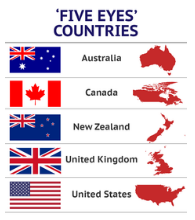
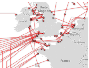
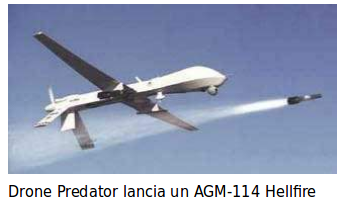
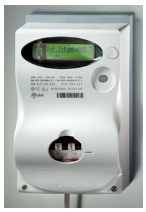

# Attaccanti

## Cyberwarfare

> La guerra è il proseguimento della politica con altri mezzi
Von Clausewitz

La guerra cibernetica (Cyberwar) è guerra con strumenti moderni basati (anche) sulla tecnologia informatica

### Aspetti

* Guerra fredda
  * _SigInt_ - acquisizione di intelligence, spionaggio
  * _PsyOps_ - operazioni di attacco psicologico subdolo
  * Acquisizione di capabilities ed esperienze
  * Interazione con agenzie di Intelligence ed Operazioni
* Guerra calda
  * _Command & Control_ - dominanza IT del campo operativo
  * _CyberWarfare_ - operazioni IT che causano danni fisici
  * _Cyber-Kinetic Warfare_ - supporto IT ad operazioni fisiche

## Attori

* **Five Eyes Alliance**
  * NSA - USA
  * GCHQ - UK
  * CSD - Canada
  * ASE - Australia
  * GCSB - Nuova Zelanda
* **Paesi NATO e Israele** (subordinati)
* **PLA3 cinese**
* **Russia**
* **Iran e Stati Arabi** (tecnologie acquistate)
* **Gruppi terroristici**
* **Gruppi libertari e coordinati di hackers**
  * Anonymous

## Iniziative

### Supercomputers

* **BullRun** e **LongHaul** - supercomputers NSA
  * Terzo supercomputer costruito nello Utah
  * _NSA Cryptanalysis and Exploitation Services_
* **Quick Ant** e **Flying Pig** - supercomputers UK GCHQ
  * Database e query di raccolta metadati di connessioni SSL/TLS mondiali (ca. 10 TB al giorno)
  * Permette attacchi Man-In-The-Middle

### Progetti

* **Disposition Matrix** aka US **Kill List**
  * Lista di terroristi e nemici che devono essere fisicamente eliminati. (Obama, 2010)
  * Prevede l'accettabilità di danni collaterali (vittime innocenti), differenziando tra americani e non.
* **PRISM**
  * Programma US di cattura globale di tutti i dati
  * Praticamente tutti i maggiori protocolli crittografici sono decrittati

## Policies di Ritenzione Dati

### GCHQ (UK)

* Tutto il traffico in arrivo, partenza o interno al Regno Unito è catturato in toto - metadati e contenuto - e conservato per 72 ore
* Anche il traffico in partenza e arrivo sui cavi dati USA-Europa attestati in Cornovaglia (40% del traffico mondiale)
* Filtri di rilevanza determinano classi di ritenzione ulteriore - fino a 10 anni

### NSA (US)

* Tutto il traffico mondiale rilevato direttamente o acquisito da Friends - di tutte le nazioni al mondo, senza consenso o conoscenza degli interessati
  * Soprattutto: anche i cittadini americani
* Tutti i metadati per 10 anni
* Contenuti interi e metadati a seconda della classe di sensitività - min 2, max 30 anni, in futuro: 100 anni

## Cyber-Kinetic Warfare

Identifica le interazioni tra guerra fisica e cibernetica:

* Attacchi fisici mirati dopo SigInt cyber
* Attacco cyber causa distruzione fisica
* Attacco fisico come risposta ad attacco cyber
  * Policy del Dipartimento della Difesa dal 2012
* Attacco fisico preventivo ad attacco cyber
  * Ai dispositivi cyber avversari

## SCADA

Non solo i sistemi individuali e aziendali sono soggetti ad attacchi. Particolare preoccupazione destano i sistemi SCADA.

### Supervisory Control And Data Acquisition

Monitoraggio e controllo di sistemi fisici industriali:

* Controllo di produzione
* Erogazione energia, acqua, ecc.
* Centrali nucleari
* Controllo rete

Le potenzialità di un attacco di successo potrebbero essere devastanti perchè:

* La popolazione civile è colpita
* Difficoltà di override manuale di sistemi altamente automatizzati
* Assenza di sistemi di backup e di ritorno al passato

## Criminali Informatici

Svolgono le loro attività a scopo di lucro. Possono essere semplici individui, ma al giorno d’oggi è molto più comune che siano gruppi ben organizzati, a causa del tempo e sforzo richiesto, e spesso dell’investimento in piattaforme costose.

Le ditte o gruppi di questo tipo ricadono in due categorie:

* Completamente anonimi
  * Mafie
  * Gruppi di hacker mondialmente distribuiti, ignoti tra loro
* Con una facciata legale
  * Enti giuridici registrati impiegati ufficialmente in attività legali
  * Con un dipartimento chiamato, p.es. di **Intelligence Competitiva**

Queste ditte e gruppi assumono e premiano personale esperto. Attenzione al _Trattamento di Fine Rapporto_.

### Provenienza degli Attacchi

In più dell’85% dei casi gli attacchi di successo, che ottengono penetrazione (breach) del computer vittima, sono operati da remoto.

Nel rimanente meno del 15% dei casi gli attacchi provengono dall’interno della rete a cui appartiene la vittima.

Degli attacchi interni, meno del 2% sono intenzionali, ed avvengono preferenzialmente in enti o ditte particolari, con strutture competitive forti (esempio: Pubblica Amministrazione).

La grande maggioranza degli attacchi interni sono compiuti ad insaputa del possessore del computer attaccante, a causa di malware subdolamente installato.

### Cui Prodest?

In ogni attacco informatico si devono identificare i ruoli di:

* Vittima
* Attaccante

Inoltre occorre accorgersi di:

* A chi giova l’attacco
* Chi viene danneggiato dall’attacco

Non necessariamente la vittima immediata è il bersaglio intenzionale, nè l’attaccante immediato è il mandatario.

Gli originanti iniziali, per confondere le acque, usano sempre una serie di computer attaccanti intermedi, gli **stepping stones**.

Inoltre il danno dell’ente vittima può essere correlato in modo contorto col vantaggio del mandante.

Non vi sono mai situazioni _win-win_, ma a volte _lose-lose_.

Nella determinazione della vittima e dell’attaccante occorre esercitare cautela e non limitarsi alle apparenze.

Può darsi che il computer attaccato sia un diversivo per distrarre l’attenzione dei difensori, e il vero attacco sia altrove.

Può essere che il computer attaccato venga disabilitato perchè altrimenti si sarebbe accorto del vero attacco, per esempio è un firewall, o router, o Intrusion Detection System, o ha relazioni di altro tipo col vero computer attaccato.

Uno **stepping stone** è un computer intermedio. Per esempio lo hacker italiano conquista un computer cinese, e da qui uno americano, e da qui uno francese. Il difensore vede provenire l’attacco dalla Francia, ma in realtà non ha idea da dove si sia originato.

La correlazione tra il danno della vittima e il vantaggio dell’attaccante può non essere palese. Per esempio una degradazione dell’efficienza di rete di un Service Provider può avvantaggiarne un altro. Oppure l’inserimento in varie blacklist degli indirizzi di un Mail Server può causare il passaggio dei clienti alla concorrenza.

## Superficie di Attacco

Sono i sistemi e le reti della vittima visibili dalla posizione topologica dell’attaccante. Per esempio la **De-Militarized Zone** (_DMZ_) in una configurazione di firewall.

Hanno importanza particolare sulla superficie di attacco:

* Vulnerabilità
  * Debolezze del software o mancanza di patch
  * Sistemi vecchi non più aggiornabili
* Esposizioni
  * Cattive configurazioni, comportamenti degli utenti o amministratori

I sistemi sulla superficie di attacco devono essere **blindati**.

L’attaccante dalla rete non conosce tutti i computer della vittima, solo quelli che vede: questa è la Superficie d’Attacco.

Blindare significa apporre il maggior numero di protezioni compatibili col compito del sistema.

## Hackers

Nella classificazione CIA gli hackers sono individui non partecipanti ad organizzazioni, oppure con affiliazione saltuaria.

Hanno notevoli conoscenze informatiche, entusiasmo tecnologico, ma scarsa conoscenza generale - quasi nessuna in materie umanistiche.

Sono preponderantemente maschi. La percentuale femminile stimata è di meno del 10%.

L’età media è tra i 18 e 25 anni. Molto entusiasmo ma poche capacità tra i più giovani, digita divide tra i più anziani. Chi sopravvive diventa criminale o membro di un gruppo mafioso - o arruolato nei servizi.

Vi sembra essere correlazione tra gli hacker e i giochi di ruolo online.

La profilazione psicologica è difficile se i ricercatori superano una certa età.

Una distinzione sulla base delle loro intenzioni è:

* **Hackers**
  * Smanettatori amanti della conoscenza recondita
* **Crackers**
  * Sfruttatori malefici delle conoscenze acquisite

Ora va più di moda considerare il _colore dei cappelli_:

* White Hat
  * Guru 'buono'
* Black Hat
  * Guru 'cattivo'
* Grey Hat
  * Guru potenzialmente o saltuariamente 'cattivo', al momento al soldo dei 'buoni'

I difensori principali sono:

* **Security Officer**
  * Ufficiale incaricato della difesa ICT
* **Penetration Tester** (_PenTester_)
  * Conduce penetrazione delle difese, su contratto, senza danneggiare, allo scopo di potenziarle

Le _caratteristiche degli hacker sono, sotto due punti di vista:

#### Scopi (perchè lo fanno?)

* Bravata personale
  * Esibizione nei confronti dei pari
  * Acquisizione conoscenze
* Utilizzo sistemi
  * Storaggio di materiale illegale
  * Piattaforme di transito o d'attacco (powned)
  * Botnets

#### Filosofie Hacker

* Libertaria – anarchica
  * Contro i segreti e il copyright
    * Pirati
* Distruttiva – nichilista
  * La tecnologa è l'impero del male
    * Hacktivists
* Cyberpunk – William Gibson e Bruce Sterling

Hackers e Crackers sono una suddivisione vecchia: gli hackers erano semplici “smanettoni” curiosi e i crackers quelli malefici. Non si usa più.

I colori dei cappelli erano anche di più, ma si sono stabilizzati in tre “sfumature di grigio”. Nessuno ammette di essere grey, tutti siamo white, e black è dispregiativo. In realtà se non ti sporchi un po’ le mani non impari niente.

Security Officer è formale, PenTester va molto di moda. Si riparla in seguito di Penetration Testing.

**powned**, a volte **p0wned** è slang hacker che viene da “own”, possedere. In questo slang si aggiunge spesso una “p” per tradizione ormai dimenticata. Il computer è “posseduto” dallo hacker.

**Cyberpunk** è uno stile di vita che denota gli hacker. La parola è stata inventata dallo scrittore canadese William Gibson nel suo romanzo “Neuromancer”, e ripreso da llo scriitore americano Bruce Sterling - molto letto in Italia. E’ un termine ufficiale, ma un po’ vecchiotto, e la maggior parte dei giovani hacker non hanno letto i libri.

### Tipi di Hacker

* **Novizio** (_Script Kiddy_, _Lamer_)
  * Si vanta molto, prova attacchi semplici, viene preso subito
* **Studente**
  * Nega di essere uno hacker, consulta siti sullo hacking, crittografa i file, legge libri, studia il linguaggio C
* **Studioso**
  * Ha cambiato luogo, nessuno lo sospetta; opera da altri computer, usa metodi steganografici, usa molti sistemi operativi, ha possibilità economiche
* **Guru**
  * Noto nel settore, è un ottimo programmatore; non è più uno hacker attivo, ha perso l'onda; ha punti di vista filosofici, forse scrive un libro.

Notare che qui non stiamo parlando dei Criminali (CIA) ma degli Hacker (CIA), categoria ristretta.

In inglese: _Novice_, _Student_, _Scholar_, _Guru_.

Il _novizio_ è giovane e non ha lavoro o è impiegato di fresco.

Lo _studente_ compie operazioni di spionaggio e hackeraggio con scarsa protezione e viene di solito preso subito nella sua azienda. Non sempre viene licenziato, ma solo ammonito. Ha entusiasmo per imparare cose nuove, ma gli manca l’esperienza.

Lo _studioso_ è insospettabile perchè non lavora in IT. Può essere un commerciale, o persona delle pulizie. Non attacca i sistemi della sua ditta ma lavora da fuori, Le capacità economiche non le ha dallo hacking, ma gli servono per andare a conferenze o comprare computer o siti web. Può essere pericoloso, frequenta ambienti social di hacker e può guidare nuove filosofie e influenzare i giovani.

Il _guru_ è “vecchio”. P.es. sapeva hackerare i modem, ma non si usano più. E’ noto, almeno tramite il suo “nickname”, a quelli vecchi quasi come lui. I giovani alle riunioni hacker lo guardano con rispetto. Ha perso l’onda e non è più pericoloso, ma forse è schedato dalla polizia.

### Io non ho segreti

Postura comune di diniego:

> “Dopotutto gli hacker non causano danni al mio computer, vogliono solo giocare e imparare. E io non ho particolari segreti.”

Danni che gli hacker possono causare:

* Uso del computer come zombie in una rete BOT, per compiere attacchi verso altri computer
* Storaggio di materiale illegale
* Uso delle risorse di CPU e RAM (specie nei grossi sistemi) per la crittanalisi o il mining di valute elettroniche
* Impianto di backdoor e sistemi di controllo remoto

Quando uno hacker è ben stabilito su un computer, per estirparlo può essere necessaria la reinstallazione da zero o addirittura la sostituzione del computer.

### Hackers nella Difesa

Un mito recita: “Ci vuole un ladro per acchiapparne un altro".

L’idea quindi è di impiegare hackers come addetti alla sicurezza informatica.

Le principali obiezioni sono:

* Psicologia bacata
  * mancanza di lealtà aziendale e comportamento etico
  * tentazione di attacchi dall’interno
* Job Turnover
  * avranno i nostri segrti nel prossimo loro lavoro
  * possono impiantare bombe logiche o a tempo

Vi sono state tre fasi evolutive del concetto di impiego di hacker:

* Fase 1. Impiegare gli hacker a scopo difensivo
* Fase 2. Tolleranza zero verso ogni tipo di hacker
* Fase 3. Impiegare gli hacker a scopo offensivo (fortunatamente poche ditte lo fanno)

Gli hacker non sono persone con comportamento sano, e non è che diventano onesti se gli si dà un lavoro. Inoltre da dentro la ditta hanno più occasioni d’attacco che non da fuori. E imparano parecchi dettagli riservati sulla ditta, che gli possono servire quando vanno a lavorare per la concorrenza.

Tutti i padroni di casa cambiano le serrature quando il loro inquilino in affitto se ne va. Eppure la password di “administrator” viene raramente cambiata quando l’amministratore di sistema se ne va.

Una Bomba Logica è un virus che scatta quando si verificano certe condizioni, p.es. una persona licenziata è cancellata dal database dei dipendenti.

Una Bomba a Tempo scatta in un momento preciso nel futuro, p.es. il prossimo venerdì 13 a mezzanotte.

### Certified Ethical Hacker

Forse è una contraddizione in termini.

Hacker con certificazione (CEH) conseguente all'esame 312-50 ($500) dello EC-Council (non ha niente a che fare con la Commissione Europea).

Serie di corsi ben curati che coprono le tecniche degli hacker, la difesa dei sistemi e delle reti, il penetration testing e l'analisi forense dei sistemi.

Il certificato CEH è molto apprezzato negli US.

Viene data molta enfasi al fatto che le azioni della persona formata devono seguire un codice di Etica.

I detrattori notano che tale certificato può generare un falso senso di sicurezza: la difesa deve essere una preoccupazione continua.

### Penetration Testing

L’unico metodo efficace di testare le difese dei sistemi informativi è tentare di attaccarli.

Il **Penetration Testing** (_PenTest_) è una prova generale di attacco, come esercitazione pianificata:

* Compiuto da personale esperto e qualificato
  * Liberatoria di responsabilità legale del PenTester
  * Non intende causare danni ai sistemi
* Con o senza conoscenza dell’attacco dal personale
  * _Plain_ o _Blind_
* Con o senza conoscenza dei sistemi dai PenTesters
  * _White Box_ e _Black Box_ testing
* Seguendo standards ben definiti e accettati
  * **Penetration Testing Execution Standard**
* Con scopo e durata limitati e rapporto finale
