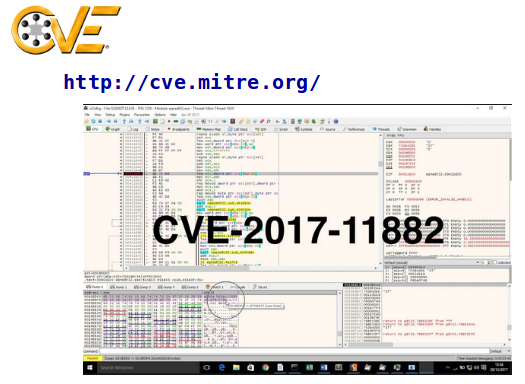
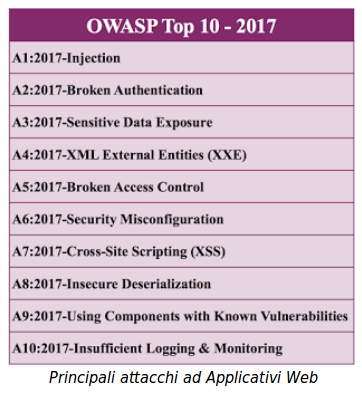
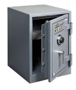
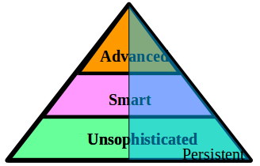
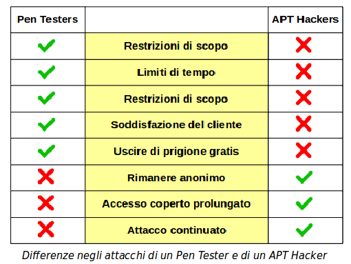

## Attacchi

## Vulnerabilità ed Esposizioni

Sono i due aspetti che determinano le debolezze del software e dei sistemi.

* **Vulnerabilità**
  * Errore del software che può essere direttamente usato da uno hacker per avere accesso a sistemi o reti
    * Sia programmi che protocolli di rete
    * Non tutte sono state scoperte
    * Non tutte è possibile correggerle

* **Esposizione**
  * Errore di configurazione o di utilizzo del software che permette l'accesso a informazioni o l'utilizzo di capacità tali da facilitare ad uno hacker l'accesso a sistemi o reti.
    * Configurazioni di default o di esempio
    * Mancata comprensione dei rischi

## Common Vulnerabilities and Exposures

E’ un catalogo che lista tutte le debolezze del software e dei sistemi scoperte finora.

Usa identificativi standard: **CVE-anno-numero**

Esempio: `CVE-2017-11882`

* Usati da tools come _Metasploit_ e vari _Vulnerability Scanners_
* Aiutato da molti collaboratori
* In cooperazione con US National Vulnerability Database
* Mantiene una lista di tutte le vulnerabilità storiche identificate

## Problemi con i Linguaggi Software

Viene spesso asserito che il linguaggio di programmazione usato è la causa principale degli errori del software. Vi sono dei _pro_ e dei _contro_ relativi a questa asserzione.

* Pro: alcuni linguaggi hanno davvero debolezze proprie
  * Buffer overflows: C
  * Memory leaks: C++, NodeJs
  * Type problems: JavaScript

* Contro: in realtà dipende molto dalle tecniche di sviluppo
  * Semplicità e comprensibilità del codice
  * Approccio Test Driven Development
  * Visibilità del codice sorgente

Nella scelta dei programmi è utile avvalersi delle seguenti discriminanti positive, che danno una garanzia sulla _bontà_ del codice:

* Il codice è consultabile su GitHub
* La comunità d’interesse è vasta
* Le modifiche sono recenti

## Vulnerabilità: OWASP Top 10

Questa è una lista di vulnerabilità più comuni degli applicativi basati su Web.

* Trend corrente
* Aggiornato ogni qualche anno
* Non è esaustivo: sono le sole vulnerabilità principali

Molti strumenti di _Penetration Testing_ si concentrano ad attaccare queste vulnerabilità specifiche.

## Spionaggio

Anche detto **Data Exfiltration**, è il prelevamento dati da un computer vittima ed il suo invio in rete al computer del criminale.

Informazioni di interesse sono:

* Documenti di qualsiasi livello di sensitività
* Chiavi e password
* Files di configurazione del sistema

Richiede necessariamente:

* Programma **malware** installato sul computer vittima
* Canale di comunicazione, probabilmente _stealth_, tra la vittima e il criminale

L’attività generale di acquisizione informazioni sulla vittima è detta **SigInt** (_Signal Intelligence_).

### Dimensione dello Spionaggio

* **Attacchi in grande stile**
  * La vittima deve avere informazioni di sufficiente interesse nazionale o pubblico
    * Enti militari e di ricerca
    * Istituti finanziari
    * Enti governativi
* **Enti medi e piccoli**
  * La vittima possiede informazioni proprietarie strategiche
    * Industria o business intermedio
    * Catene di distribuzione
    * Enti medici e assicurativi
* **Micro-Intelligence**
  * Informazioni limitate di interesse a certi individui
    * Ruolini paga
    * Documenti di policy

### Piccoli Sistemi

Le informazioni più a rischio di esfiltrazione sono sui mini e micro sistemi:

* personal computers
* smartphones e tablets

L’attività di navigazione web implica, anche involontarie:

* la condivisione della lista contatti
* il tracking di navigazione tramite cookies ed altro
* la rivelazione della locazione geografica
* i patterns d’uso
* le caratteristiche del sistema e dell’hardware

Sono tutti punti d’aggancio per attacchi di _SigInt_.

Considerazioni di base:

* **I piccoli sistemi non devono avere informazioni sensitive**
* **I sistemi con informazioni sensitive non devono navigare in rete**

Al limite impostare delle _whitelist_ dei soli siti consentiti. Questo può diventare tedioso, ma aumenta fortemente la sicurezza, e impedisce che il personale navighi a caso nell'orario di lavoro.

### Esfiltrazione Fisica

Dati sensibili possono essere sottratti da parte di personale interno su:

* chiavi USB e dischi fissi
* smartphones
* PC portatili
* altri dispositivi rimuovibili di registrazione dati

Un ente con dati sensitivi e in regime di alta sicurezza deve proibire la presenza di tutti questi dispositivi

* Segmentare i locali acceduti in classi di sicurezza
* Monitorare anche il personale di pulizie e servizi

Attenzione alla corretta distruzione di dati

* Cartaceo in uno _shredder_
* Limitare al minimo i documenti provvisori in cartaceo
* Supporti dati in collezione separata poi inceneriti
* Conservare tutto il materiale sensitivo in cassaforte.

Le chiavette USB sono un grosso disatro di sicurezza e andrebbero proibite: ci si mette su il lavoro aziendale insieme alle foto dei figli e a filmini porno. Le foto contengono coordinate GPS e i filmini dei virus di vario tipo.

Poi vengono usate per passare dei file veloci ai colleghi, che si copiano anche il resto.

Molte ditte forniscono un PC portatile che ci si porta anche a casa e si usa per altri scopi, con pericoli a non finire di introduzione di malware in ditta.

I documenti temporanei stampati sono email, documenti word, fogli excel. Poi vengono buttati nel cestino di riciclo carta e messi fuori dalla porta. Io ne ho trovati a iosa negli enti pubblici in Toscana, dove sono ecologici. Si imparano cose imbarazzanti.

I PC vecchi vengono anch’essi o buttati o portati a stazioni di riciclo e abbandonati, con tutti i dati ancora dentro!

### PC Roaming

PC degli executives, che viaggiano e che devono comunque contenere dati sensibili.

La quotazione di ricettazione di un PC di un executive di una ditta Fortune 500 è in America circa $10000.

I furti avvengono soprattutto negli aeroporti.

Contromisure:

* Crittografazione del disco fisso
* Backup su supporti crittografati che non viaggiano col PC
* Whitelist di navigazione web
* Comunicazione con **Virtual Private Network**  e solo con la casa madre
* Schermo con campo visuale ristretto
* Togliere tutte le icone dallo schermo
* Eliminazione di logo e distintivi aziendali

In un qualsiasi aeroporto o treno Italo si vedono persone che lavorano al loro notebook in maniera forsennata. Quando il treno va a Roma il gergo lo chiama “portare il lavoro a Termini”.

Con una telecamerina è molto discreta di 70 ingrandimenti si vede benissimo quello che fanno.

All’aeroporto si mette il PC sul carrello poi si aspetta il proprio turno per i raggi X. C’è un intoppo e ci si mette tempo. Poi quando si arriva di la il PC non c’è più.

Davanti all’hotel vicino a Termini mentre si telefona alla moglie un cinesino scippa la borsa col PC e fugge verso il quartiere Esquilino. Impossibile ribeccalo.

Alla stazione a Torino un albanese ti urta maldestramente e cadete tutti e due. Poi quando ti aiuta a rialzarti il tuo trolley non c’è più. E mentre ti guardi disperato in giro è sparito anche l’albanese.
Consigli: i dati sono crittografati, mantenere un backup su One Drive e usare un PC che non costa più di €400 (si chiama un “Computer Bic”).

### Contromisure per i Server

Dipendono dalla sensitività dei dati

* Storaggio sicuro dei dati
  * Sicurezza fisica di accesso
  * Cura della sicurezza dei backup e delle repliche
* Autenticazione d’accesso forte
  * Autenticazioni multi-fattore
  * Certificati anche per i client
  * Logging degli accessi e auditing periodico
* Crittografazione delle comunicazioni
  * Crittografare anche le comunicazioni interne
  * Reti Virtuali Private (_VPN_ - _Virtual Private Networks_)
* Firewalls intelligenti
  * _Proxy_ - niente accesso diretto interno-esterno
  * _Intrusion Detection Systems_ (IDS) anche per i dati in uscita

## Data Tampering

E’ la modifica ai dati storati nel sistema vittima, a vantaggio del criminale remoto:

* dati sensibili o non riproducibili
* dati di Personal Identification Information (PII)
* tokens di autenticazione
* attributi collegati all’identità
* profili di autorizzazione

Si possono distinguere due casi:

* **Modifiche non scoperte**
  * Possono causare danni o perdite anche gravi
* **Modifiche scoperte**
  * Anche solo poche modifiche possono causare una mancanza di fiducia in tutti i dati

Occorre un’assoluta fiducia nell’integrità dei dati.

Questo implica anche test continuativi di efficacia.

### Indizi di Tampering

Occorrono strumenti di monitoraggio continuo e detezione anomalie: Host-based Intrusion Detection System (H-IDS).

Indizi comuni possono essere:

* Picchi anomali di accessi falliti
* Picchi di accesso ai dati
* Attività inconsuete di accesso ai dati
* Accessi fuori da orario consueto
* Accesso a dati archiviati

Uno **IDS Net-based** è un intero computer che monitorizza la rete alla ricerca di pacchetti dati anomali.

Uno **IDS Host-based** è un programma su un computer che lo monitorizza in continuazione alla ricerca di programmi o comportamenti anomali.

### Difese dal Tampering

Esistono più linee di difesa, da progettare:

* **Checksum dei dati**
  * Calcolo di un checksum a intervalli regolari
  * Mantenere i checksum crittografati o offline
  * Verifica regolare dei checksum
  * Allerta immediata in caso di cambiamento imprevisto
  * Vi sono strumenti automatici appositi
* **Versionamento dei dati**
  * Le procedure ufficiali che modificano i dati ne compiono un commit al termine
  * Il versionamento automaticamente fornisce un timestamp e compie un checksum
  * E’ sempre possibile un checkout ad una previa versione
* **Blockchain**
  * Per sua natura è immutabile
  * Mantenere nel blockchain i dati o i puntatori ai dati

Un **Checksum** è un numero Hash calcolato da un file; se cambia il file cambia anche il checksum.

Programmi che forniscono e mantengono checksums sono economici ma richiedono disciplina d’uso.

Per lo sviluppo programmi e documenti a più riprese, un **Controllo Versione** non solo fornisce un checksum, ma permette anche di tornare a versioni precedenti.

Le tecnologie **Blockchain** sono il futuro prossimo della sicurezza dei dati. Un Blockchain è un archivio immutabile e storico di tutte le versioni compiute. Al momento lo si usa per Bitcoin, ecc. ma presto esploderà in tutti i campi applicativi.

### Osservazioni

Più probabilmente l’attacco di Data Tampering proviene dall’interno:

* Computer zombie o con volontà della persona

Occorre identificare al più presto:

* L’**agente** colpevole
* Quali siano i **dati corrotti**
* Quali siano i **dati non coinvolti** e di cui ci si fida

Devono essere configurate procedure automatiche di backup dei dati, e devono essere compiuti test continui e veritieri di restore parziale.

Un restore può non ripristinare l’ultima versione corrente dei dati:

* I dati devono essere suddivisi in classi con indice di tempo di perdita accettabile.

**Zombie** è un computer controllato da remoto da uno hacker.

Occorre per primo determinare quale sia il programma che corrompe i dati e fermarlo.

Se non siamo subito in grado di determinare il programma malefico occorre spegnere il computer di brutto - non shutdown - e sottoporlo ad Analisi Forense, che può essere operazione lunga e penosa.

Un computer che corrompe i dati non deve rimanere acceso!!

Poi bisogna essere in grado di determinare quali sono i dati corrotti e quali ancora no. Se non siamo in grado tutti i dati devono considerarsi potenzialmente corrotti.

In tal caso occorre un restore da una copia garantita non corrotta.

## Ripudio

Vista la pervasività di dati illegali o programmi malefici su ogni tipo di computer, impiantati a insaputa del possessore, si può verificare la seguente situazione:

Il possessore è veramente responsabile dei dati o programmi, ma lo nega: ripudia la responsabilità.

Gli elementi software illegali sono spesso dissimulati da software e dati legali o borderline con metodi di steganografia (dati nascosti). I livelli di dissimulazione possono essere molteplici.

Situazione esempio di diniego plausibile:

* Un file PDF quando esaminato con metodi anti-steganografici rivela contenere un’immagine porno.
* Le autorità concludono che tale è il materiale nascosto (non completamente illegale) e sono soddisfatte.
* L’immagine porno a sua volta però contiene un archivio di password o altri dati veramente sensibili.

La steganografia è diversa dalla crittografia e viene approfondisce nel seguito. E’ una serie di metodi per nascondere i dati in modo che nessuno nemmeno ne sospetti l’esistenza.

Naturalmente gli analisti bravi cercano e trovano i dati nascosti. A questo punto la difesa è di dissimularli facendoli appartenere a categorie diverse dalla loro natura: questo è detto **Diniego Plausibile**.

E’ una operazione di _Ingegneria Sociale_ (vedi oltre): immediata categorizzazione del colpevole e della colpa, errata ma plausibile. La furbizia stà nel fingere i dati nascosti come materiale immorale.

I veri dati nascosti, pericolosi e non immorali, sono ad un livello di occultamento ulteriore. Ma l’analista crede di aver trovato tutto il trovabile e non cerca oltre.

### Contrastare il Ripudio

L’unico metodo efficace è un auditing estremo di tutte le operazioni compiute da tutti, molto poliziesco, molto pesante di amministrazione.

In assenza di auditing non si possono avere prove certe, e l’amministratore che ripudi la volontà propria nel Data Tampering non può che essere assolto per assenza di prove.

Se il sistema ha un livello di sicurezza elevato, per esempio **Security Enhanced Linux** (_SELinux_) (pronuncia: “esse e linux”), tutti i dati e programmi hanno un possessore ben identificato ed il ripudio è impossibile.

SELinux è un sistema sofware imposto dall’agenzia NSA americana per i computer degli enti pubblici.
E’ mito metropolitano che SELinux inoltre compia spionaggio automatico per la NSA.

Ma è richiesto _Linux Enterprise_ e l’amministrazione di SELinux è complessa.

Con sistemi personali o mobili il ripudio deve essere accettato, con beneficio del dubbio per il possessore.

Quello che è veramente importante è **impedire che i dati sospetti escano e transitino in rete**, quindi la scoperta di tutti i possibili canali di comunicazione nascosta tra un computer e l’hacker remoto, e la loro eliminazione.

In alcune nazioni la crittografazione di file systems è illegale, o la polizia deve essere fornita di _passphrase_ d’accesso a richiesta.

Possono essere impiegati “metodi convincenti”.

## Diniego di Servizio

E’ impedire volutamente il funzionamento dei sistemi o delle reti della vittima.

Si distingue in:

* **Denial of Service** (_DOS_) da parte di un singolo attaccante
* **Distributed Denial of Service** (_DDOS_) da parte di molti attaccanti simultaneamente

Gli attacchi DOS coinvolgono spesso anche computer o reti non della vittima designata: danni collaterali. Questo è dovuto alla interconnessione complessa in Internet, e anche a connessioni esistenti ma non documentate.

### Scopi del DOS

* **Attacco di Cyberwarfare**
  * Nazionale o terroristico. Può avvenire per:
    * Parte di guerra calda vera
    * Pressione e intimidazione sul nemico
    * Vendetta limitata a torti subiti
* **Diversivo**
  * Per nascondere delle azioni offensive nei confronti di computer terzi
  * Occorre considerare quali relazioni di fiducia hanno i computer attaccati nei confronti degli altri
* **Degradazione del Servizio**
  * Per favorire la concorrenza a scopo di lucro
  * Per screditare politicamente l’ente vittima (Hackerism)
  * Per richiedere riscatto (**Ransomware**)

Il DOS vuole distruggere. Nè gli hacker nè i criminali di solito vogliono distruggere i computer, ma conquistarli e usarli, e di solito a scopo di lucro diretto o indiretto.

Il primo e storico motivo di DOS è da parte di uno hacker di dimostrare come è “bravo”. Ma è passato di moda.

Il secondo motivo è di arrecare danno al nemico, nazionale, politico, commerciale o religioso. Questo tipo di DOS è in forte espansione.

### Detezione e Responso

La detezione è probabilmente rapida, visto il degrado repentino delle performance.

Occorre comunque dichiarare ufficialmente lo **stato di attacco**:

* Si rende attiva la **Squadra di Responso**
* Potrebbe essere un malfunzionamento naturale dovuto a condizioni transienti

Occorre determinare l’ambito ed estensione dell’attacco:

* Un sistema
* Un’intera rete
* Tutte le nostre reti
* Il nostro _Access Provider_
* Una parte più vasta dell’Internet

Il responso immediato implica l’isolamento dei componenti attaccati dal resto della rete: **air gap**.

Air Gap - spazio d’aria - è lo slang per staccare il cavo di rete: c’è dell’aria tra la spina e la presa.

I componenti attaccanti, se identificati, sono subito spenti.

I DOS sono per forza sostenuti nel tempo, ma non possono avere durate troppo lunghe. Sono di solito dai pochi minuti ai giorni, con qualche ora come media. Più tempo durano e più l’attaccato ha modo di organizzarsi e far intervenire le Squadre di Responso aziendali o nazionali.

Se un mero PC individuale è coinvolto in un DOS di vasta portata non può praticamente farci niente e deve attendere l’intevento di altri. Si consiglia di staccarsi dalla rete e lavorare temporaneamente in locale.

La Squadra di Responso ad un DOS ha il difficile problema di identificare i veri responsabili, al più presto, in particolare la locazione fisica da cui parte l’attacco. Se sono hackers o criminali interviene la polizia.

Se l’attacco è condotto da una potenza straniera e si scopre quale, può essere in futuro un “casus belli”.

Se è condotto da un **BotNet** (vedi oltre) con mandante non identificabile, non si può forse praticamente fare niente, se non aspettare che smetta.

## BOTs

**BOT** è l’abbreviazione di **Robot**, ed originariamente era un programma autonomo per lo svolgimento di operazioni ripetitive con comunicazioni in rete.

Si possono distinguere tre tipologie:

* **Bot Benevoli**
  * Compiono azioni vantaggiose per più attori ed eque (_fair_)
  * Si adeguano alle specifiche del file di controllo `robot.txt`
* **Bot Malevoli**
  * Compiono azioni vantaggiose per un attore ma inique (_unfair_) o svantaggiose per altri
  * Ignorano il file `robots.txt`
* **Bot Malefici**
  * Concepiti per compiere azioni dannose per una o più vittime

Un BOT veniva anche chiamato un Agente Intelligente

### BOT Benevoli

Un Bot Benevolo è di vantaggio a chi lo usa e a chi viene usato. Esempi possono essere:

* Ricerca orari di treni o aerei
* Ricerca di un prodotto o servizio ottimale, fornito da più mercanti
* Ricerche bibliografiche o testuali da vari siti offerenti
* Indicizzazione di siti web
  * Detti _Web Spiders_ o _Web Crawlers_
* Giochi di ruolo online e strumenti di Chat

I siti che servono i Bot Benevoli hanno di solito un **Application Programming Interface** (_API_) standard e documentata, ed una **Policy d’Uso Accettabile** (_AUP_).

### Bot Malevoli

Un Bot Malevolo compie operazioni in emulazione o sostituzione di un essere umano, che sarebbe troppo lento. La sua velocità operativa va a discapito degli altri esseri umani veri con cui concorre.

Esempi possono essere:

* Aumento degli “I Like” di siti per incrementarne il rating
* Aumento del traffico per gli _Analytics_ e il SEO (_Search Engine Optimization_)
* Acquisto di biglietti e token a favore di bagarini
* Commercio elettronico automatico per creazione di scarsità o domanda
* _Fake accounts_ su siti social per influenzare politicamente i veri partecipanti

I Bot Malevoli spesso sfruttano la presenza di **algoritmi di ranking**, o la **presunzione implicita di reale esistenza**.

Un BOT malevolo non è criminale, ma è “unfair”: compie operazioni di rete troppo velocemente rispetto ad un essere umano.

L’uso di Bot malevoli è molto comune nella giungla Internet da parte di grossi enti.

Istituti Finanziari della City sono alla continua ricerca di piccoli vantaggi finanziari nel trading mondiale e compiono migliaia di transazioni al secondo, da ciascuna delle quali guadagnano pochi pennies.

In alcuni social è noto che metà degli accounts e tre quarti del traffico sono fake.

Se gli algoritmi di ranking sono noti è possibile inventare Bot che modificano le preferenze per certi siti o servizi. Dato che i siti web tracciano la provenienza delle richieste e registrano le preferenze, un Bot malevolo che ha contraffatto l’indirizzo di provenienza può facilmente compromettere la reputazione di un cittadino onesto.

La maggior parte dei progettisti di siti web presume che verranno visitati da umani, non da Bots, e non ha previso quanto veloci siano i Bot.

### Bot Malefici

I Bot Malefici sono programmi inavvertitamente installati e sotto il controllo di un criminale remoto.

Il computer infettato con un tale Bot viene detto **zombie**.

Lo zombie compie operazioni malefiche con traffico illegale in uscita.

Il criminale lentamente infetta con lo stesso Bot un numero elevato di computer che poi può controllare: una **BotNet**.

Le BotNets contano molte migliaia di zombie, e a volte vengono affittate per compiere attacchi.

Le azioni criminose compute possono essere:

* Attacchi di Diniego di Servizio Distribuito (DDOS)
* Campagne di spam o di _phishing_
* _Scraping_ (copia totale) di siti web per impersonarli
* Diffusione di virus e vermi

I BOT malefici non sono “unfair”: eseguono operazioni che violano la legge. Paesi diversi però hanno leggi diverse.

In particolare non è ben definita globalmente la posizione legale di un paese che ospità un Bot che compie le sue operazioni al di fuori di tale paese: tocca agli altri difendersi.

Se un Bot compie 10 connessioni di rete al secondo, 1000 Bot con attacco coordinato vanno meglio, e si arriva ad un milione di nodi per alcuni BotNet.

In casi moderni i nodi non sono PC ma oggetti stupidi dell’**Internet of Things**. Nel 2016 l’attacco _Mirai_ è stato compiuto da un milione di telecamere di sorveglianza infettate, e ha “tirato giu” la CNN e il Guardian. Questo sarà un problema interessante per il prossimo futuro.

### Difesa dai BOT

* **BOT Malevoli**
  * **CAPTCHA**: attività per discriminazione tra essere umano e robot - _Test di Turing_
    * Esempio: riconoscimento immagini
    * Ma col _Machine Learning_ i BOT stanno diventando bravi
  * Limitazione di richieste e traffico (_throttling_)

* **BOT Malefici**
  * Impedire la comunicazione diretta tra computer interni alla rete e l’esterno
    * Uso di Proxy
    * Monitorare il traffico in uscita
    * Egress Filtering
    * Net-based Intrusion Detection Systems (N-IDS)

Il vecchio problema del Test di Turing è di far parlare un essere umano tramite terminale, con qualcuno nell’altra stanza, e decidere se è un umano o un computer.

Le cose che i computer sanno fare peggio sono il riconoscimento delle immagini, e i Captcha sono programmi che si basano proprio su questo.

“Captcha” viene da “capture”, con la modifica che lo fa sembrare la parola slang americana “gotcha” - I got you - ti ho beccato.

I programmi di Intelligenza Artificiale, in particolare di Deep Learning, stanno però diventando sempre più bravi nel riconoscimento di immagini.

Tali programmi hanno bisogno però di essere addestrati, fornendo loro immagini e dicendogli cosa sono. Da qui imparano.

La cosa malefica è che una buona parte dei Captcha presenti in rete non sono Test di Turing veri, ma istanze di training per i motori di Deep Learning. Noi stiamo insegnando ai computer in modo che poi loro possano impersonarci.

L’unico modo efficace di contrastare i Bot è di rallentarne le operazioni: un massimo al minuto.

“Throttle” vuol dire “strozzare”.

Gli zombie vanno sempre combattuti. Non si può impedire che vengano installati a nostra insaputa, ma si può contrastare la loro comunicazione tra i nostri computer e lo hacker che li controlla.

Lo **Egress Filtering** - filtraggio in uscita - presuppone che anche i nostri computer possano eseguire operazioni malefiche nei confronti di terzi, e le bloccano.

Gli **IDS Net-based** ispezionano quindi anche i pacchetti in uscita per difendere il resto del modo da noi.

Anzichè proteggere migliaia di computer aziendali dall’impianto surrettizio di Bots, è più facile costringere il traffico attraverso un Proxy, e sterilizzare tale macchina dai Bot.

## Attacchi Avanzati

Un **threat** è una minaccia potenziale ad un sistema informativo con più o meno difese.

Quando le difese sono superate si ha un **breach** (ingresso).

Conseguentemente al breach si possono avere danni.

Sono visti tre livelli di threat:

* **Unsophisticated**
  * Di bassa intelligenza
  * Le normali difese bastano
* **Smart**
  * Con strumenti intelligenti
  * Più difficile contrasto
* **Advanced**
  * Con molti strumenti d’attacco
  * Molto ardui da contrastare

Se l’attacco è pesante e continuato vi si dà l’attributo **Persistent**.

Una minaccia ha un target definito e non è traffico casuale.

Una minaccia non sofisticata è un esecizio hacker da principiante.

Una minaccia smart è più complessa, contiene dissimulazione, ha un inventore più capace, e richiede una difesa più pianificata. Si tratta comunque sempre di una tipologia singola di attacco.

Uno Advanced Threat è superintelligente, usa molte tipologie di attacco simultanee, è costato svilupparlo e costa mantenerlo.

Persistent denota solo che l’attacco dura nel tempo. In realtà solo le minacce Advanced sono anche Persistent, le altre due sono di bassa lega e non ne vale la pena.

### Advanced Persistent Threat

I target di Advanced Persistent Threats (**APT**) sono sistemi di alto valore, non PC.

Gli APT Hackers sono gruppi organizzati o enti statali:
La conduzione di attacchi APT richiede molte risorse

Gli APT Hackers devono essere molto competenti

I sistemi target hanno elevate difese passive e sistemi di detezione e prevenzione intrusioni, ma:

Possono venire infettati internamente da malware apposito

Vengono usate spesso vulnerabilità non ancora scoperte, per cui non esistono divese (Zero Day Vulnerabilities)

Le operazioni sono stealth e ben dissimulate

Lo APT viene a volte scoperto molto dopo (mesi) il suo impianto, quando ha causato danni considerevoli

C’è spesso l’elemento sorpresa: tipi di attacchi innovativi e non previsti.

Uno 0day - Zero Day Vulnerability o Virus o Attack - è qualcosa che non si era visto prima, e come con un nuovo virus biologico non vi è immunità nè vaccini. Ci vuole tempo a svilupparli e intanto i sistemi sono vulnerabili.

Uno APT è una vergogna per le grosse ditte o enti statali che lo subiscono, e a volte quando è scoperto non viene ammesso.

Questo è vero soprattutto per gli Enti Finanziari, che perderebbero reputazione e clienti.

A volte la denuncia che un ente ha subito un APT può essere fake, allo scopo di danneggiarli. Purtroppo se si può dimostrare di aver subito un APT, non si pò facilmente dimostrare di non averlo subito.

I fake news sono comunque sempre un grosso problema di reputazione.

### PenTesting e APT

Le attività di un Penetration Tester e di un APT Hacker sono simili, ma hanno anche differenze notevoli.

Un PenTester compie attività legali, evidentemente un APT Hacker no.
