# Servizi di Hacking

## NSA Tailored Access Operations

Servizi offerti dal _National Security Agency_ ad agenzie esecutive americane.
Qualcosa di simile è fornito in Cina dal _People's Liberation Army 2nd bureau - 3rd department_ (3PLA)

* Targeted Surveillance
* Impianto di Backdoors
* Exploits su target
* Data exfiltration
* Location tracking
* Escalation a KIll List e “handover” a CIA Spec Ops o equivalente cinese
* Usa _standards_ per l'interoperabilità dei suoi prodotti, come QUANTUMINSERT e FOXACID
* Infezione iniziale con redirezioni su server che assomigliano a server web Apache
* Molti programmi scritti in Python
* A volte hanno anche dei bachi

### Esempio: SIM Cards

Le SIM Moderne (fase 2+) la hanno SIM Toolkit API (STK):

* Esecuzione di comandi e richieste al FW del telefono
* Può essere aggiornato da USB o direttamente dal Vendor come upgrade (contratto obbligatorio?)
* Molti (tutti?) vendor sono in collaborazione con NSA (e Huawei anche 3PLA?)

I pacchetti malefici sono iniettati con gli upgrade: il sofware si chiama MONKEYCALENDAR

* Compilato per ogni specifico modello e in continua evoluzione
* Permette il **Data Exfiltration**: SMS ignote al possessore (quasi sempre gratuite)
* Gelocation
* Intervalli raccolta dati configurabili
* In standby per Diniego di Servizio

### Interdiction

Merce IT ordinata da USA tramite corriere:

* Tutti (?) i corrieri cooperano
* La merce viene intercettata dal NSA
* Componenti selezionati dell'HW sono sostituiti con componenti infetti
* La merce è reimpacchettata professionalmente e fatta proseguire

Talvolta l'Interdiction avviene presso i Vendor stessi.

Pare sia molto comune coi prodotti cinesi.

### NSA Ant Catalog

Catalogo del 2008 di prodotti a disposizione per l'acquisto da parte di agenzie nazionali americane autorizzate.

#### NightStand

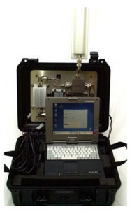

Equipaggiamento standard operativo NSA almeno dal 2008 per _Close Access Operations_:

* Sniffer e Packet Injector da campo
* Hardened PC con Fedora Core di base
* In continua evoluzione
* Solitamente in un furgoncino o van
* Attacchi WiFi
  * Target: tutti i Windows
  * Iniezione vettori e payload
* Può usare amplificatori e antenne esterne
* Non è rilevato dal target

#### Altri Esempi

P.es. alcune versioni HP Proliant, non tutte e non solo

* HW Implant: WAGONBED
  * Comunica tramite l'interfaccia I2C
* HW Implant: IRONCHEF
  * Essenzialmente un backdoor che monitorizza la presenza continuativa di un determinato malware software impiantato
  * Se l'utente, accorgendosi del malware, lo rimuove - comunica col distributore del malware, ne ottiene una nuova copia e reinfetta il computer
* USB tap: FIREWALK e COTTONMOUTH (50 per $200)

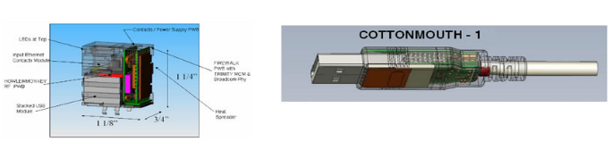

* Impianto su scheda madre: GODSURGE
  * Alcune versioni Dell PowerEdge
  * Costo $500
  * Configurabile da remoto

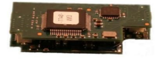

* Impianti su scheda madre: HOWLERMONKEY

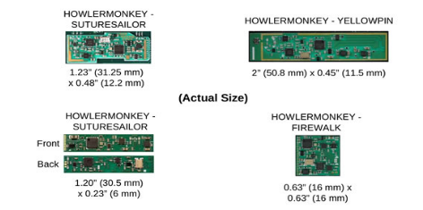

* HW Implant: RAGEMASTER
  * Trasmette il canale rosso VGA
  * Standard VAGRANT
  * Programmi con cui interagisce:
    * NIGHTWATCH
    * GOTHAM
    * VIEWPLATE

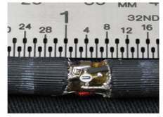

* Attivato da illuminatore CW CTX4000
  * Standard VAGRANT e DROPMIRE
  * fino a 100 W sul bersaglio

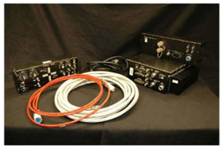

## Hacking-as-a-Service

Sia ditte che gruppi che privati offrono servizi di hacking a pagamento. La situazione legale può essere incerta, come per il commercio di armi.

Gli individui e i gruppi di hacker sono tipicamente reperibili sul **Dark Web**. In queste categorie le attività sono sempre coperte e formalmente illegali.

Le ditte ufficialmente offrono servizi di Sicurezza Informatica, Sorveglianza o Recupero Password - a volte è una facciata per veri servizi criminali. Se il cliente è un ente delle forze deell’ordine o le operazioni sono al di fuori dello stato, esistono scappatoie legali per il commercio.

Ditte che forniscono strumenti e servizi di sorveglianza, spionaggio e attacco hacker sono, per esempio:

* BlueCoat
  * Routers con sniffers e taps
* Gamma
  * FinSpy e **FinFisher**
    * Licenza, installazione e training per la polizia segreta dell'Egitto: €300.000

Clienti tipici:

* Non hanno la tecnologia per sviluppare strumenti simili in proprio
* Governi autoritari arabi o del terzo mondo
  * Prove per Malesia, Etiopia, Egitto

Target tipici:

* Dissidenti politici che vivono in aree non direttamente controllate dalle forze nazionali

### Gamma FinFisher

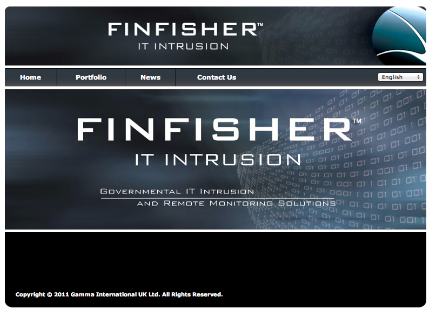

Ha svariate _features_:

* Bypass di 40 antivirus comuni tramite mutazione del codice
* Canale covert di comunicazione con HQ
* Pieno monitoraggio di Skype
* Sorveglianza covert con webcam e microfono del PC
* Key-logger
* Tracciamento di locazione con vari metodi
* Upload covert di files da HD
* Analisi forense remota
* Filtri di rilevanza configurabili
* Agente disponibile per Windows, Linux, Mac
* Infezione tramite tecnologie Metasploit o Ingegneria Sociale
* Fatturato stimato €98M (2006-2013)
  * Di cui €2M dall'Italia

Gli “impiegati” delle ditte menzionate sopra, che sono anglosassoni, devono essere inglesi, di buona famiglia e di buona educazione. Devono avere visione politica ultraconservativa e preferibilmente aver lavorato per i “servizi”.

C’è un forte sospetto che tali ditte siano molto coinvolte col governo di Sua Maestà.

### Hacking Team

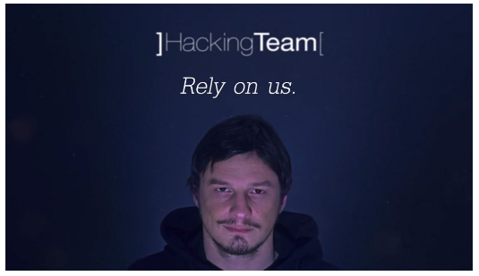

Hacking Team (Via della Moscova13, Milano, Italia)

* Da luglio 2012
* Attacchi documentati in Marocco, Repubbliche Arabe Unite, Colombia, Kazakistan, Oman, ... (fonte WikiLeaks)
* Committenti: governi ufficiali (ma non ufficialmente)
  * Anche fornitore della polizia italiana
* Targets: gruppi di dissidenti
* Sito web pubblico: `www.hackingteam.it`
  * Offrono lavoro (tel. 02 29060603)
* Hackerati di recente: 1 milione di messaggi email

La Hacking Team e altri sono sempre alla ricerca di personale di due tipologie.

La prima è di **programmatori** e hacker super esperti - quelli che “sognano in esadecimale”. Del resto i bravi programmatori non hanno particolari problemi a trovare lavoro.

La seconda fisura professionale sono **executive**, per la vendita e il Business Relationship Management. Sono persone dall’aspetto autorevole, dall’esperienza provata nel mondo cybersecurity, che sanno l’inglese alla perfezione e viaggiare senza farsi notare. E devono essere maschi perchè gli arabi sono il mercato migliore.

### Vupen Security

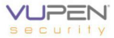

VUPEN Security (Francia)

Dal 2012 in ex colonie francesi.

* Attacchi basati su 0day Exploits
* Collaborazione probabile con Hacking Team ed altri
* Spudorate asserzioni di solo comportamento etico nel Customer Policy

La deontologia professionale del programmatore richiederebbe che chi scopre uno Zero Day Vulnerability lo comunichi alla ditta che ha scritto il programma.

Purtroppo non tutte le ditte software hanno l’umiltà di ammetterlo o la dovuta riconoscenza verso lo scopritore.

Il vantaggio di Vupen e altre ditte simili è che pagano per gli 0day, fino a €50000 per quelli più appetibili.

## Dark Net

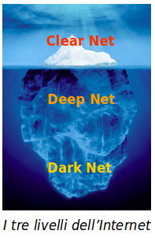

Non tutti i computer esistenti al mondo sono visibili in Internet o reperibili con i normali motori di ricerca.

Si distinguono tre livelli di rete:

* **Clear Net** (_Surface Net_ - _World Wide Web_)
  * Sono i computer registrati nei domini e reperibili tramite normale ricerche DNS (_Domain Name System_)
* **Deep Net** (_Deep Web_)
  * Sono computer non registrati a dominio, o registrati in domini alternativi a quelli ufficiali. Spesso sono computer di reti locali o i client e i personal computer.
* **Dark Net** (_Dark Web_)
  * Sono computer volutamente nascosti alle normali ricerche e per accedere ai quali occorre software particolare.

_Dark Net_ e _Dark Web_ sono praticamente sinonimi.

Nella sua accezione, la Dark Net è una **overlay network**, ovvero usa il trasporto di base della normale Internet.

Vi sono ancora (poche) reti che usano trasporti completamente alternativi, spesso storici, come _UUCP_ o _FidoNet_ un tempo basati sui modem. Sono quasi introvabili dalle polizie, ma molto inefficienti.

I protocolli usati dalla Dark Net sono volutamente diversi da quelli della Clear Net. Lo scopo è di sfuggire al controllo delle autorità nazionali di vigilanza.

Alcuni stati perseguono ideologie, religioni, politiche ed orientamenti specifici. In tali stati l’uso del Dark Net è un vantaggio libertario.

L’uso etico o meno della Dark Net è indipendente dalle tecnologie.

Vi sono vari ambienti Dark Net, tra cui _GUnet_, _Freenet_, _I2P_ e soprattutto **Tor**.

## Tor

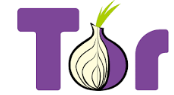

Progetto libertario per la privacy online consistente in un browser Firefox modificato.

* Usa la rete con **Onion Routing**
* Permette la navigazione anonima
* Disponibile per Windows, Mac, Linux e Android

E’ basato sul contributo volontario di macchine che fungono da relay per l’implementazione della rete anonima - al momento sono circa 6000.

E' odiato e combattuto da polizie ed enti statali.

Il fatto che parecchi nodi dello _Onion Routing_ ormai appartengano a polizie o enti di spionaggio non ne inficia il comportamento anonimo.
Solo se un ente controlla tutti i relay d’uscita è in grado di impedire il traffico.

Comunque è praticamente impossibile determinare il mittente.

In alcuni stati il possesso di Tor è illegale.

Tor è Open Source e quindi dimostrabilmente libero da trucchi o malware.

Chi lo usa si assume la responsabilità se sta violando la legge locale per l’uso che ne fa.

Non serve solo a navigare nel Dark Web ma anche ai giornalisti o ai dissidenti politici.

I relay sono gestiti da volontari entusiasti e sono in paesi dove la libertà di comunicazione è sanzionata dalla legge. Questi sono tendenzialmente nel modo occidentale.

In paesi ove Tor è proibito è possibile impostare dei “bridge” non listati alla rete Tor che semplicemente confondono ulteriormente il traffico senza crittografarlo.

In pratica la rete Tor è una grossa collezione di _stepping stones_.

L’uso appropriato e flessibile, per aumentare ancora la sicurezza, prevede tutta una serie di configurazioni. Leggere il manuale.

Alcuni formati come Flash (_FLV_) sono considerati troppo pericolosi e non portati da Tor. Questo esclude gran parte dei siti porno tradizionali - molti si sono adattati a MP4 o formati streaming.

### Onion Routing

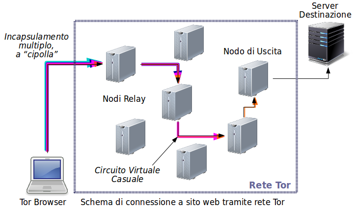

Lo “Onion Routing” - a cipolla - si chiama così perchè ogni singolo pacchetto è composto da più strati.

Una prima fase iniziale scopre tra tutti i nodi della rete quali sono attivi e disponibili e decide casualmente un certo numero di essi da cui tansitare, ovvero stabilisce un “circuito virtuale”. Questo viene cambiato ad intervalli regolari scegliendo un altro insieme di nodi intermedi.

Viene generato il pacchetto finale in chiaro tra il nodo di uscita dalla rete Tor e il server web di destinazione. Questo pacchetto viene “incapsulato” in un pacchetto più grande per il traffico tra il penultimo nodo e il nodo di uscita, e crittografato con la chiave pubblica del nodo finale.

A sua volta tale pacchetto è incapsulato in un altro per il traffico tra il terzultimo e penultimo nodo, e crittografato con la chiave pubblica del penultimo.

Così via a ritroso fino alnostro computer, il mittente iniziale.

Nessun intercettatore di traffico sa mai più che il mittente del tratto locale. I mittenti dei tratti precedenti sono crittografati. E’ impossibile conoscere il mittente originale.

Il nodo di uscita è il più delicato perchè vede il traffico in chiaro. Può dedurre il sistema operativo del mittente, il nome del browser e la dimensione dello schermo. Ma anche queste informazioni possono essere dissimulate con un po’ di avvedutezza.

## Dark Web in Pratica

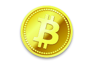

Più del 90% del Dark Web ospita contenuti di commercio Business to Consumer, illegali secondo i canoni occidentali.

* **Materiale fisico**
  * Armi
  * Droghe
  * Documenti falsi
  * Ricettazione
* **Servizi**
  * Furti
  * Omicidi
  * Spionaggio ed attacchi a computer
  * Riciclaggio di denaro sporco
* **Materiale informatico**
  * Pedopornografia
  * Violazione di copyright

La valuta di pagamento usuale è **Bitcoin**.

Se si comportano con alcune cautele, gli amministratori ed utenti del Dark Web sono in pratica non identificabili.

Purtroppo in pratica si usa Tor per accedere al Dark Web e sfuggire al controllo della polizia per compiere attività illegali.

Paesi diversi hanno evidentemente insiemi diversi di attività illegali.

Il pagamento avviene in valuta difficilmente rintracciabile, quindi prevalentemente Bitcoin. Nessuno ha veramente modo di lamentarsi se viene imbrogliato.

La difficoltà è il recapito di oggetti fisici. La malavita si è ormai organizzata anche come corrieri di materiale acquistato nel Dark Web.

Non è evidentemente necessaria alcuna registrazione o prova di identità per comprare sul Dark Web, basta pagare. Se viene presentato un form di registrazione, è inteso che venga fornito uno pseudonimo inventato e non il nome vero: questo serve solo al riconoscimento di sessione.

Le aziende sul Dark Web vanno e vengono in continuazione perchè spesso scoperte dalle polizie nazionali. P.es. il sito “Silk Road”, che vende droghe, è già nella sua terza incarnazione.

Qualora servisse nel Clear Web, vi sono anche siti che offrono un indirizzo di posta elettronica temporaneo o altri token di identità finti.
