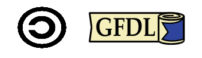

# Licenza



La presente documentazione è distribuita secondo i termini della GNU Free Documentation License Versione 1.3, 3 novembre 2008.

Ne è garantita assoluta libertà di copia, ridistribuzione e modifica, sia a scopi commerciali che non.

L'autore detiene il credito per il lavoro originale ma nè credito nè responsabilità per le modifiche.

Qualsiasi lavoro derivato deve essere conforme a questa stessa licenza.

Il testo pieno della licenza è a: https://www.gnu.org/licenses/fdl.txt

## Ringraziamenti


Si ringrazia la Iso Sistemi srl (https://www.isosistemi.it/) per la sponsorizzazione nello sviluppo del corso corrente.

```text
Iso Sistemi S.r.l.
Piazza della Vittoria 11 A/8
16121 Genova Italy 
Tel: +39 01053749.1 
Fax: +39 01053749.499 
Mail: isosistemi@isosistemi.it 
PEC: isosistemi@legalmail.it
```
